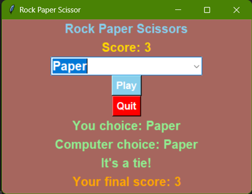

# Rock-Paper-Scissors Game
This is a simple Rock Paper Scissors game implemented in Python using the Tkinter library for the graphical user interface.

## Features
<li>
  <ul>Play Rock Paper Scissors against the computer.</ul>
  <ul>Keep track of your score.</ul>
  <ul>Simple and intuitive user interface.</ul>
</li>

<li><u>Screenshot</u>
  <ul></ul>
</li>
